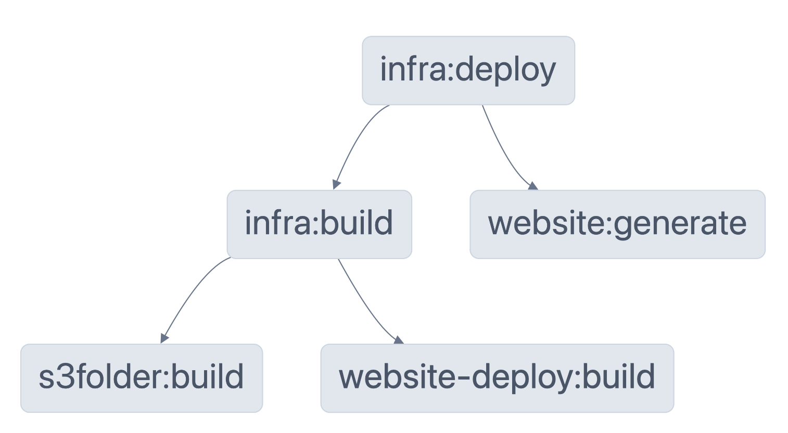

# Nx Monorepo

This example shows how to use Nx to organize a mono repo and track dependencies.

The example consists of the following components:

```
 - packages:
     - s3folder: ComponentResource that manages a S3 bucket
     - website-deploy: ComponentResource resource that manages files in a S3 bucket
     - website-builder: Mock website generator that creates HTML output
 - infra: Pulumi program that uses the s3folder and website ComponentResources to deploy a website
```

To deploy the latest version of the website, we need to respect the following dependencies:

- website-builder needs to be compiled before we can use it to generate the HTML output.
- s3folder and website-deploy need to be compiled before we can build infra.
- We need to generate HTML output before we can deploy the infra.
- infra needs to be compiled before we can deploy.

These dependecies can be defined using Nx, for example in [infra/package.json](./infra//package.json) we declare that the `deploy` needs its dependencies to be built, and the HTML to generated:

```
    ...
    "nx": {
        "targets": {
            "deploy": {
                "dependsOn": [
                    "build",
                    "website-builder:generate"
                ]
            }
        }
    }
```

Nx can visualize the dependencies for us using `npx nx deploy infra --graph`



## Deploying

### Prerequisites

1. [Install Pulumi](https://www.pulumi.com/docs/get-started/install/)
2. [Configure AWS Credentials](https://www.pulumi.com/docs/intro/cloud-providers/aws/setup/)

### Steps

Since Nx manages the interdependencies, all we have to do is to install our node dependencies

```bash
npm install
```

and then run nx:

```bash
npx nx deploy infra
```

```
  ✔    4/4 dependent project tasks succeeded [0 read from cache]

  Hint: you can run the command with --verbose to see the full dependent project outputs

———————————————————————————————————————————————————————————————————————————————————————————————————————————————————————————————————————————————————————————————————————


> nx run infra:build


> infra@1.0.0 build
> tsc


> nx run infra:deploy


> infra@1.0.0 deploy
> pulumi up --stack dev

The stack 'dev' does not exist.

If you would like to create this stack now, please press <ENTER>, otherwise press ^C:
Created stack 'dev'
Previewing update (dev)

View in Browser (Ctrl+O): https://app.pulumi.com/julienp/nx-monorepo/dev/previews/fc7630fd-7dc4-4c7e-baa0-3d6e014fc90a

     Type                                  Name                 Plan
 +   pulumi:pulumi:Stack                   nx-monorepo-dev      create
 +   ├─ pulumi:examples:WebsiteDeploy      my-website           create
 +   │  └─ aws:s3:BucketObject             index.html           create
 +   └─ pulumi:examples:S3Folder           my-folder            create
 +      ├─ aws:s3:Bucket                   my-folder            create
 +      ├─ aws:s3:BucketPublicAccessBlock  public-access-block  create
 +      └─ aws:s3:BucketPolicy             bucketPolicy         create

Outputs:
    websiteUrl: output<string>

Resources:
    + 7 to create

Do you want to perform this update? yes
Updating (dev)

View in Browser (Ctrl+O): https://app.pulumi.com/julienp/nx-monorepo/dev/updates/1

     Type                                  Name                 Status
 +   pulumi:pulumi:Stack                   nx-monorepo-dev      created (6s)
 +   ├─ pulumi:examples:S3Folder           my-folder            created (5s)
 +   │  ├─ aws:s3:Bucket                   my-folder            created (1s)
 +   │  ├─ aws:s3:BucketPublicAccessBlock  public-access-block  created (0.76s)
 +   │  └─ aws:s3:BucketPolicy             bucketPolicy         created (0.85s)
 +   └─ pulumi:examples:WebsiteDeploy      my-website           created (2s)
 +      └─ aws:s3:BucketObject             index.html           created (0.80s)

Outputs:
    websiteUrl: "my-folder-a64ab3c.s3-website.eu-central-1.amazonaws.com"

Resources:
    + 7 created

Duration: 9s


———————————————————————————————————————————————————————————————————————————————————————————————————————————————————————————————————————————————————————————————————————

 NX   Successfully ran target deploy for project infra and 5 tasks it depends on (42s)
```

To destroy the stack, we run:

```
npx nx destroy infra
```

```
> nx run infra:destroy


> infra@1.0.0 destroy
> pulumi destroy --stack dev

Previewing destroy (dev)

View in Browser (Ctrl+O): https://app.pulumi.com/julienp/nx-monorepo/dev/previews/b640cce7-a9df-49a5-b004-3fbdbe65c4eb

     Type                                  Name                 Plan
 -   pulumi:pulumi:Stack                   nx-monorepo-dev      delete
 -   ├─ pulumi:examples:S3Folder           my-folder            delete
 -   │  ├─ aws:s3:BucketPolicy             bucketPolicy         delete
 -   │  ├─ aws:s3:BucketPublicAccessBlock  public-access-block  delete
 -   │  └─ aws:s3:Bucket                   my-folder            delete
 -   └─ pulumi:examples:WebsiteDeploy      my-website           delete
 -      └─ aws:s3:BucketObject             index.html           delete

Outputs:
  - websiteUrl: "my-folder-a64ab3c.s3-website.eu-central-1.amazonaws.com"

Resources:
    - 7 to delete

Do you want to perform this destroy? yes
Destroying (dev)

View in Browser (Ctrl+O): https://app.pulumi.com/julienp/nx-monorepo/dev/updates/2

     Type                                  Name                 Status
 -   pulumi:pulumi:Stack                   nx-monorepo-dev      deleted (0.31s)
 -   ├─ pulumi:examples:WebsiteDeploy      my-website           deleted (0.60s)
 -   │  └─ aws:s3:BucketObject             index.html           deleted (0.88s)
 -   └─ pulumi:examples:S3Folder           my-folder            deleted (0.82s)
 -      ├─ aws:s3:BucketPolicy             bucketPolicy         deleted (0.96s)
 -      ├─ aws:s3:BucketPublicAccessBlock  public-access-block  deleted (0.91s)
 -      └─ aws:s3:Bucket                   my-folder            deleted (0.74s)

Outputs:
  - websiteUrl: "my-folder-a64ab3c.s3-website.eu-central-1.amazonaws.com"

Resources:
    - 7 deleted

Duration: 7s

The resources in the stack have been deleted, but the history and configuration associated with the stack are still maintained.
If you want to remove the stack completely, run `pulumi stack rm dev`.

———————————————————————————————————————————————————————————————————————————————————————————————————————————————————————————————————————————————————————————————————————

 NX   Successfully ran target destroy for project infra (18s)
```
